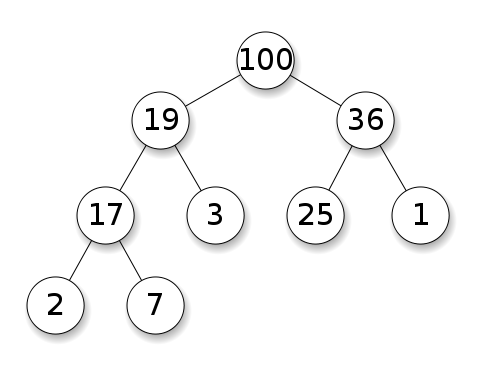

[back](../README.md)

# Heap

힙은 완전 이진트리의 형태를 갖추며, 각 부모 노드와 자식 노드들 사이의 특정한 룰을 지키고 있는 자료구조이다. 여기서 특정한 룰에 따라 max heap, min heap으로 나뉜다.
- Max Heap: 각 부모 노드의 값이 자식 노드들의 값보다 큰 힙
- Min Heap: 각 부모 노드의 값이 자식 노드들의 값보다 작은 힙

