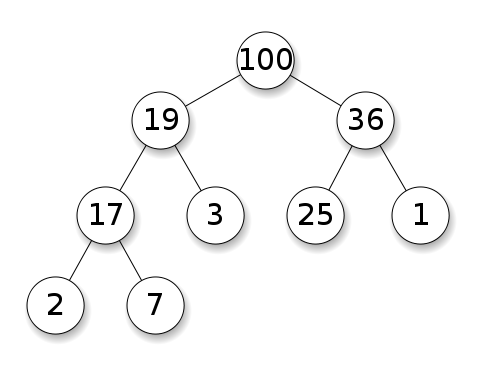
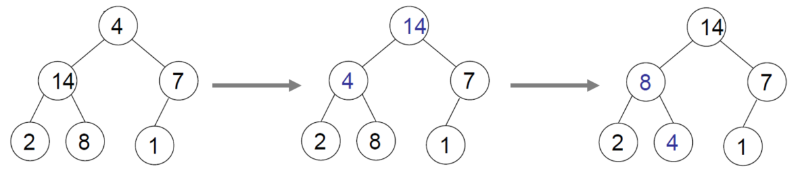

[Data Structure](../README.md)
[Array](../a__array/README.md) - [Stack & Queue](./README.md) - [List](../c__list/README.md) - [Heap](../x__heap/README.md)

---

# Heap

힙은 완전 이진트리의 형태를 갖추며, 각 부모 노드와 자식 노드들 사이의 특정한 룰을 지키고 있는 자료구조이다. 여기서 특정한 룰에 따라 max heap, min heap으로 나뉜다.
- Max Heap: 각 부모 노드의 값이 자식 노드들의 값보다 큰 힙
- Min Heap: 각 부모 노드의 값이 자식 노드들의 값보다 작은 힙

## Heapify

Heapify 는 주어진 데이터를 힙의 구조로 만드는 작업을 말한다.  
Max heap은 부모 노드의 값이 자식 노드들 값보다 크게 만드는 작업, min heap은 작게 만드는 작업이다.  

첫 상태에서 최상의 노드인 루트(root) 노드의 값이 4, 자식 노드의 값은 14, 7이다. Max heap의 조건을 만족하지 못하기 때문에 자식 노드와 부모 노드를 바꿔 준다.  
자식 노드들 중, 왼쪽을 먼저 선택하여 바꿔 준다.  

첫 번째 바꾼 이후, 4를 가진 노드의 자식 노드들을 살펴보자.  
4보다 큰 값인 8을 가진 자식 노드가 있다. Max heap 조건을 만족하기 위해 8를 가진 노드와 4를 가진 부모 노드를 바꿔준다.  

두 번째 바꾼 이후, 노드들을 보면 max heap의 조건을 모두 충족한다.  
따라서 더 이상 heapify를 진행하지 않아도 된다.  

## Insert

새로운 노드를 추가할 때, 
1. 맨 마지막 자리에 넣어 준다. 완전 이진트리이기 때문에 맨 마지막자리는 항상 마지막 leaf 레벨로 들어간다.
2. 이후 heapify를 진행한다.

## Delete

기존의 노드를 삭제할 때,
1. 삭제할 노드와 맨 마지막 노드를 스위치한다. 
2. 스위치 한 후, 맨 마지막 노드를 drop한다.
3. 이후 heapify를 진행한다.

---

[Array](../a__array/README.md) - [Stack & Queue](./README.md) - [List](../c__list/README.md) - [Heap](../x__heap/README.md)  
[Data Structure](../README.md)  
