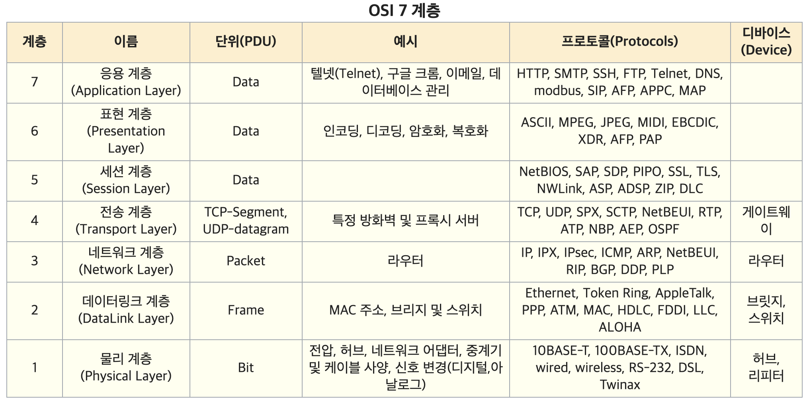

# OSI 7 Layer
네트워크 프로토콜이 통신하는 구조를 7개의 계층 나누어 표현한 것을 OSI 7Layer라고 한다.  

## Application Layer
사용자가 네트워크를 이용할 수 있도록 한다. 여러 애플리케이션을 통해 네트워크를 사용하는 것을 생각하자.

### HTTP
웹 서버와 웹 브라우저 사이에서 정보를 주고 받도록 정해놓은 통신 규약이다.  
서버와 클라이턴 간의 연결을 유지하지 않는다. 요청을 받으면 응답을 하고 끝이다.  

### HTTPS
HTTP 프로토콜 통신을 암호화하여 만든 프로토콜이다. S의 뜻이 SSL(Secure Socket Layer)이다.
SSL 3.0 을 참조하여 표준으로 정한 것이 TLS(Transport Layer Security)이다.  

HTTPS 연결을 하기 위해 공개키와 개인키를 만든다. 그리고 공개키를 신뢰할 수 있는 인증 기관에 비용을 지불하고 맡긴다.  
이후 클라이언트가 웹 서버로 요청을 보내면 웹서버는 공개키를 클라이언트에 보낸다. 공개키가 신뢰할 수 있는 인증 기관으로부터 확인한 후 일치하면  
이 공개키를 가지고 암호화하여 데이터를 전송한다. 웹 서버는 암호화된 데이터를 자신기 갖고 있는 개인키를 가지고 복호화한다.

## Presentation Layer
데이터의 인코딩/디코딩이 이뤄지는 단계이다. 또한 암호화/복호화도 이 단계에서 이뤄진다.

## Session Layer
두 컴퓨터 간의 세션을 관리한다. 포트를 사용한다. 두 컴퓨터 간의 연결이 full duplex / half duplex 인지 확인한다.  
TCP/IP 세션을 만들고 없애는 작업을 수행한다.  

## Transport Layer
### TCP
신뢰성을 위해 흐름 제어, 오류 제어, 혼잡 제어을 수행한다.  
흐름 제어를 위해 보낼 데이터 양을 제어한다. 데이터 누락이 발생하면 데이터를 재전송하여 보정한다.

연결을 맺을 때: 3-way Handshake, 
Client -> SYN -> Server  
Client <- ACK/SYN <- Server  
Client -> ACK -> Server  

연결을 종료 할 때: 4-way Handshake,
Client -> FIN -> Server  
Client <- ACK <- Server  
  
Client <- FIN <- Server  
Client -> ACK -> Server  

### UDP
완전성을 보장하지 않지만 TCP처럼 가상회선을 만들 필요가 없다. 효율적인 데이터를 보내기에 적합하다. 실시간 스트리밍 영상 데이터를 보낼 때 유용하다.  

## Network Layer
데이터를 목적지까지 가장 안전하고 빠르게 전달한다. 라우팅, 흐름 제어, 세그멘테이션, 오류 제어, 인터 네트워킹 등을 수행한다. IP주소를 통해 데이터를 전송한다.

## Data Link Layer
맥(MAC)주소를 가지고 1계층에서 받은 데이터를 전달한다. CRC 기반의 오류 제어와 흐름 제어를 통해 단 대 단(point to point) 간의 신뢰성을 보장한다.

## Physical Layer
물리적인 데이터 전달을 담당한다. 통신 케이블, 허브 등으로 통해 1 또는 0의 데이터 전송만 담당한다. 데이터가 무엇인지 관여하지 않는다.

http://wiki.hash.kr/index.php/OSI_7_%EA%B3%84%EC%B8%B5
